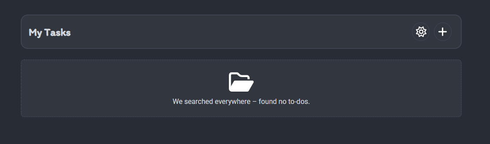

# To Do app

## The To Do app

This is a simple to-do app. To-dos are saved in local storage and always loaded from there (no synchronization between multiple devices). To-dos can be created, marked as completed, and deleted. Two themes are available: light and dark.

## So you can clone the project

- First you copy the github download link

```bash
git clone https://github.com/DigitaleWeltLibrary/to-do-app
```

- Then you have cloned the repository in your directory
- After that you have to install the node packages

```bash
npm install
```

- you are ready to start the app

```bash
npm run dev
```

## Used techniques

- vite
- react
- FontAwesomeIcon

## Themes

### Light theme


### Dark theme



## Version
V1.0: functionality and UI

V2.0: new UI design with To Do status
